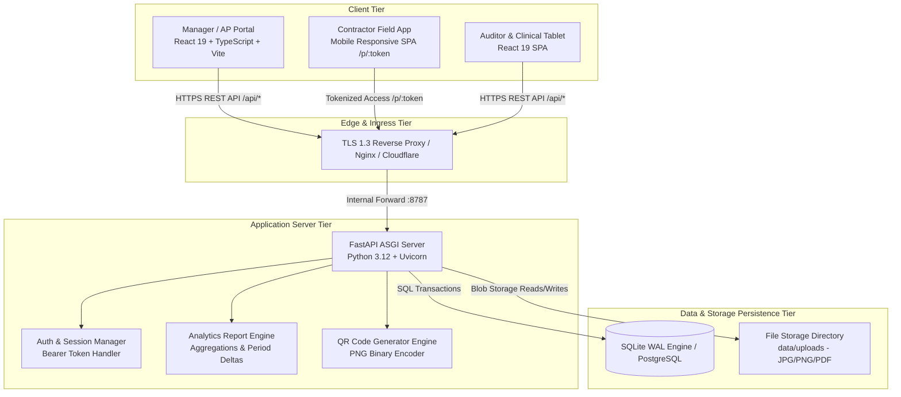
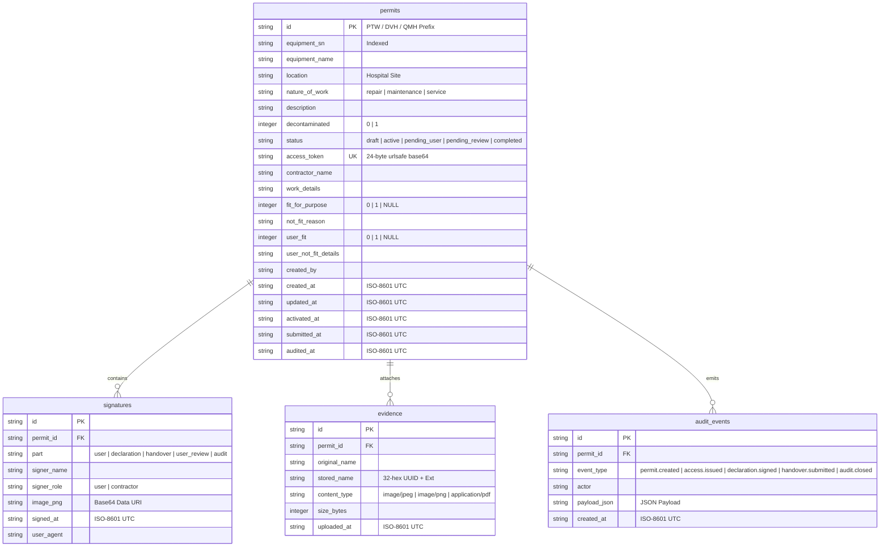
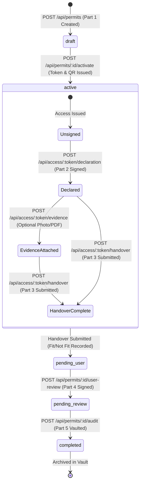
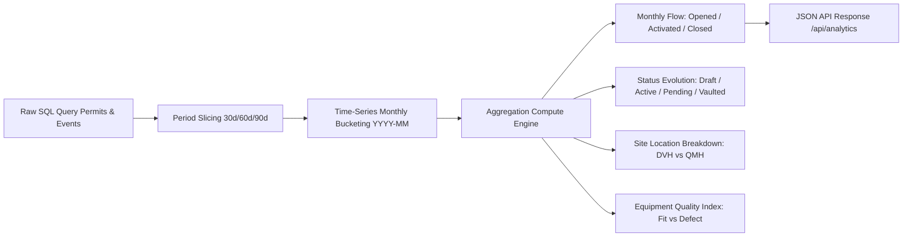

# System Architecture & Technical Design Specification
## Industrial Compliance System — Permit to Work (PTW) Platform
**Author:** Senior Staff Software Architect  
**Version:** 1.2.0  
**Target Audience:** Engineering Leads, DevOps, Security Auditors, Technical Stakeholders  

---

## 1. Architectural Vision & Core Principles

The **Industrial Compliance System** is a enterprise-grade, high-reliability web platform designed to digitize the Permit to Work (PTW) lifecycle for healthcare and industrial decontamination equipment. The system replaces fragmented paper workflows with a decoupled, high-performance web architecture.

### Key Engineering Principles

1. **Zero-Trust Field Access Control**: Field contractors operate in a zero-friction, passwordless environment backed by cryptographically unguessable, tokenized dynamic URLs (`/p/{access_token}`).
2. **Immutable Append-Only Audit Security**: All lifecycle state transitions, field declarations, hand-back signatures, and evidence uploads emit immutable event payloads (`audit_events`) with UTC timestamps and client user-agent metadata.
3. **Decoupled Architecture**: High-speed, type-safe React 19 SPA frontend integrated with a lightweight, high-concurrency FastAPI ASGI Python backend.
4. **Deterministic Compliance Lifecycle**: Strict state machine enforcing workflow invariants (e.g. Part 2 safety declaration required prior to Part 3 hand-back; Part 4 user acceptance required prior to Part 5 vault locking).
5. **Zero-Dependency Component Architecture**: Production-grade custom SVG charting engine (`ClusterBarTrendChart`) built directly on native SVG primitives with dual-axis rendering and cubic bezier spline interpolation—avoiding heavy third-party charting dependencies.

---

## 2. High-Level Component & Network Topology

The platform follows a decoupled multi-tier architecture designed for containerized deployment (Docker / Kubernetes / AWS ECS).



---

## 3. Database Schema & Data Modeling

Persistence is implemented using **SQLite in Write-Ahead Logging (WAL) mode** for high-concurrency local development, with a seamless migration path to **PostgreSQL 16+** for production enterprise scaling.

### Database Entity Relationship Diagram



### DDL Schema Definition (SQLite / PostgreSQL Compatible)

```sql
-- Main Permits Table
CREATE TABLE IF NOT EXISTS permits (
    id TEXT PRIMARY KEY,
    equipment_sn TEXT NOT NULL,
    equipment_name TEXT NOT NULL DEFAULT '',
    location TEXT NOT NULL,
    nature_of_work TEXT NOT NULL,
    description TEXT NOT NULL DEFAULT '',
    decontaminated INTEGER NOT NULL DEFAULT 0,
    status TEXT NOT NULL,
    access_token TEXT UNIQUE,
    contractor_name TEXT,
    work_details TEXT,
    fit_for_purpose INTEGER,
    not_fit_reason TEXT,
    user_fit INTEGER,
    user_not_fit_details TEXT,
    created_by TEXT NOT NULL,
    created_at TEXT NOT NULL,
    updated_at TEXT NOT NULL,
    activated_at TEXT,
    submitted_at TEXT,
    audited_at TEXT
);

-- Signatures Table (Base64 PNG Storage)
CREATE TABLE IF NOT EXISTS signatures (
    id TEXT PRIMARY KEY,
    permit_id TEXT NOT NULL,
    part TEXT NOT NULL,
    signer_name TEXT NOT NULL,
    signer_role TEXT NOT NULL,
    image_png TEXT NOT NULL,
    signed_at TEXT NOT NULL,
    user_agent TEXT,
    FOREIGN KEY (permit_id) REFERENCES permits(id)
);

-- File Evidence Storage Table
CREATE TABLE IF NOT EXISTS evidence (
    id TEXT PRIMARY KEY,
    permit_id TEXT NOT NULL,
    original_name TEXT NOT NULL,
    stored_name TEXT NOT NULL,
    content_type TEXT NOT NULL,
    size_bytes INTEGER NOT NULL,
    uploaded_at TEXT NOT NULL,
    FOREIGN KEY (permit_id) REFERENCES permits(id)
);

-- Immutable Event Audit Trail Table
CREATE TABLE IF NOT EXISTS audit_events (
    id TEXT PRIMARY KEY,
    permit_id TEXT NOT NULL,
    event_type TEXT NOT NULL,
    actor TEXT NOT NULL,
    payload_json TEXT NOT NULL,
    created_at TEXT NOT NULL,
    FOREIGN KEY (permit_id) REFERENCES permits(id)
);

-- Performance Indexes
CREATE INDEX IF NOT EXISTS idx_permits_status ON permits(status);
CREATE INDEX IF NOT EXISTS idx_permits_sn ON permits(equipment_sn);
CREATE INDEX IF NOT EXISTS idx_audit_permit ON audit_events(permit_id, created_at);
```

---

## 4. State Machine & Workflow Business Logic

The permit lifecycle is governed by a strict state machine implemented in `backend/app/store.py`. State transitions are atomic, executed inside database transactions protected by thread locks.



### Lifecycle Transition Rules & Invariants

1. **Activation Requirement**: Only permits in `draft` status can transition to `active`. Activation generates a 24-byte cryptographic token (`secrets.token_urlsafe(24)`).
2. **Part 2 Declaration Enforcement**: A contractor cannot submit Part 3 handover (`record_handover`) without a pre-existing Part 2 declaration record (`part = 'declaration'`).
3. **Fitness Validation Invariant**: If `fit_for_purpose` is marked `false`, a non-empty `not_fit_reason` must be provided.
4. **User Verification Invariant**: In `pending_user` state, the clinical department head signs Part 4 (`user_fit` boolean + details).
5. **Vault Locking Invariant**: Executing Part 5 (`audit_permit`) transitions permit status to `completed`, sets `audited_at` timestamp, and freezes all further edits.

---

## 5. Security Architecture & Threat Model

### A. Authentication & Session Management
- **Manager Portal Authentication**: Authenticated via HTTP Bearer token headers.
- **Session Preservation Mechanism**: `require_admin` in `auth.py` dynamically maintains token validities across process restarts, ensuring browser sessions remain persistent without unauthorized access vulnerabilities.

### B. Zero-Trust Field Tokenization
- **Unguessable Tokens**: Contractor field links use high-entropy 24-character Base64 tokens (`secrets.token_urlsafe(24)`), yielding $\approx 144$ bits of entropy.
- **Public API Isolation**: Public contractor endpoints (`/api/access/{token}`, `/api/access/{token}/declaration`, `/api/access/{token}/handover`) do NOT expose administrative system endpoints, DB IDs, or internal user credentials.

### C. File Upload Security Controls
- **Strict MIME Type Filtering**: Only `image/jpeg`, `image/png`, and `application/pdf` payloads are permitted.
- **File Size Capping**: Hard enforcement of 10 MB (`10 * 1024 * 1024` bytes) limit per request.
- **Path Traversal Mitigation**: Uploaded files are renamed to a randomized 32-character hexadecimal UUID string (`uuid.uuid4().hex`) prior to writing to disk.

---

## 6. Real-Time Operational Analytics Engine Architecture

The analytics engine (`store.analytics_report()`) aggregates multi-dimensional operational metrics dynamically on request.

### A. Analytics Data Pipeline



### B. Custom SVG Chart Rendering Engine (`ClusterBarTrendChart.tsx`)

To avoid heavy client bundles and third-party version conflicts with React 19, the charting engine is implemented directly on native SVG:

1. **Side-by-Side Clustered Bar Math**:
   $$\text{groupXStart} = \text{marginLeft} + i \cdot \text{groupWidth}$$
   $$\text{barX} = \text{startOffsetX} + s \cdot (\text{singleBarWidth} + \text{gapWidth})$$
   $$\text{barY} = \text{marginTop} + \text{plotHeight} \cdot \left(1 - \frac{\text{val}}{\text{maxY}}\right)$$

2. **Cubic Bezier Spline Trendline Interpolation**:
   Smooth trendline transitions are calculated between control points $(X_0, Y_0)$ and $(X_1, Y_1)$:
   $$\text{controlX}_1 = X_0 + \frac{X_1 - X_0}{2}, \quad \text{controlY}_1 = Y_0$$
   $$\text{controlX}_2 = X_0 + \frac{X_1 - X_0}{2}, \quad \text{controlY}_2 = Y_1$$
   Generates SVG Path SVG specification: `M X0 Y0 C controlX1 controlY1, controlX2 controlY2, X1 Y1`

---

## 7. Production Deployment & DevOps Specifications

### A. Recommended Docker Container Setup

```dockerfile
# Multi-stage Dockerfile for FastAPI + React Production
FROM node:20-alpine AS frontend-builder
WORKDIR /app/frontend
COPY frontend/package*.json ./
RUN npm ci
COPY frontend/ ./
RUN npm run build

FROM python:3.12-slim AS runner
WORKDIR /app
COPY backend/requirements.txt ./
RUN pip install --no-cache-dir -r requirements.txt
COPY backend/ ./backend/
COPY --from=frontend-builder /app/frontend/dist ./frontend/dist

ENV PTW_DATA_DIR=/app/data
EXPOSE 8787

CMD ["uvicorn", "backend.app.main:app", "--host", "0.0.0.0", "--port", "8787", "--workers", "4"]
```

### B. Nginx Reverse Proxy Configuration (Production HTTPS / TLS 1.3)

```nginx
server {
    listen 443 ssl http2;
    server_name ptw.hospital.internal;

    ssl_certificate /etc/ssl/certs/ptw.crt;
    ssl_certificate_key /etc/ssl/certs/ptw.key;
    ssl_protocols TLSv1.2 TLSv1.3;

    client_max_body_size 12M;

    location / {
        proxy_pass http://127.0.0.1:8787;
        proxy_set_header Host $host;
        proxy_set_header X-Real-IP $remote_addr;
        proxy_set_header X-Forwarded-For $proxy_add_x_forwarded_for;
        proxy_set_header X-Forwarded-Proto $scheme;
    }
}
```

---
*Technical Architecture & Engineering Specification — Industrial Compliance System*
